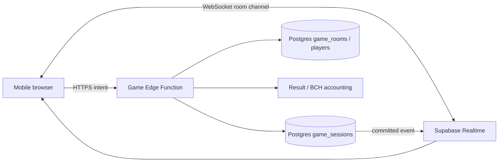

# BIG CRUISE Mobile-First Real-Time Multiplayer Architecture

**Status:** Proposed architecture

**Scope:** UNO, Ludo, Chess, Tic-Tac-Toe, Connect Four, Draw It Out, Werewolf, Codenames, Word Guess, Karaoke, Truth or Dare, and Kahoot.

## Executive recommendation

BIG CRUISE should use **Supabase Realtime over WebSockets for room events**, while keeping **Supabase Edge Functions and Postgres as the authoritative game boundary**. The WebSocket should distribute events quickly, not decide whether a move is legal. Every client must be able to reconnect, discard stale events, request a fresh snapshot, and continue from the latest server version.

This approach fits the current application because the database already contains `game_rooms`, `game_players`, and `game_sessions`. The existing Edge Functions already perform server-side validation and optimistic version checks. The main change is to replace frequent state polling with a Realtime channel and retain polling only as a slow recovery fallback.

> **Core rule:** clients send intents; the server validates intents, commits the next state, and publishes the committed result.

## System topology



The mobile client has three separate responsibilities:

1. **Render the latest accepted snapshot.**
2. **Send a user intent**, such as `move`, `draw`, `submit`, `ready`, or `leave`.
3. **Maintain the connection lifecycle**, including authentication refresh, reconnect, resubscribe, and snapshot recovery.

The Edge Function has four responsibilities:

1. Authenticate the user and verify room membership.
2. Validate the intent against the current state.
3. Commit the next state with an optimistic `version` check.
4. Publish one committed event after the database update succeeds.

Postgres remains the source of truth. Realtime Broadcast is the transport for low-latency room events. Supabase documents Broadcast for low-latency application messages and Presence for small online-state payloads [1] [2].

## Room channel model

Each match uses one private channel:

```text
room:{game}:{roomCode}
```

The channel should be authorized only for authenticated room members. The room code is not a secret; authorization must still be checked server-side. A user who guesses a code must not receive state or submit actions unless that user exists in `game_players` for the room.

The channel carries three categories of messages.

| Message | Direction | Purpose | Durable? |
|---|---|---|---|
| `game_event` | Server to clients | A committed state transition or lifecycle change | State is durable in Postgres |
| `presence` | Client to Realtime | Online, background, and connection hints | No |
| `room_signal` | Client to clients | Typing, cursor, drawing preview, or ready animation | No |

Game state messages should use the smallest useful payload. For board games, the preferred event contains the action and resulting version. Clients can apply the action locally only as an animation optimization; they must accept the server snapshot as final.

```json
{
  "type": "game_event",
  "roomCode": "AB12CD",
  "game": "connect4",
  "eventId": "01J...",
  "version": 18,
  "action": {
    "type": "move",
    "playerId": "user-uuid",
    "column": 3
  },
  "state": {
    "turn": "Y",
    "winner": null
  },
  "serverTime": "2026-09-24T10:00:00Z"
}
```

For larger states such as UNO hands or Draw It Out stroke histories, send a compact event whenever possible and use a full snapshot only at join, reconnect, or recovery. Do not send a full canvas bitmap for every pointer movement.

## Authoritative write path

The client sends an intent over HTTPS to the existing game Edge Function. This is intentional. It provides a single place for authentication, validation, rate limiting, result accounting, and optimistic concurrency.

The write sequence is:

1. The client reads its current `roomCode` and `lastAppliedVersion`.
2. The client submits an intent with an idempotency key.
3. The Edge Function loads the current session and validates membership.
4. The Edge Function checks the game rule and turn ownership.
5. The Edge Function updates `game_sessions` with `WHERE id = ? AND version = ?`.
6. If zero rows are updated, the intent loses a race and the function returns a conflict response.
7. If the update succeeds, the function publishes `game_event` with the new version.
8. All clients apply the event in version order.

The server must never publish before the database commit. Otherwise a mobile client can render a move that another request successfully overwrites.

### Idempotency

Each intent should contain an `intentId`, generated on the client. The server should retain recent processed intent IDs per session or include them in a short-lived deduplication table. If a mobile network drops after the server commits but before the response reaches the client, the client will retry. The retry must return the already-committed result rather than applying the move twice.

For drawing, idempotency should be paired with stroke sequence numbers. A stroke event should include `strokeId` and `sequence`. The server should reject duplicates and ignore an older sequence that has already been committed.

## Client synchronization state machine

The mobile client should expose a small connection state in the game UI:

```text
idle
  -> connecting
  -> synced
  -> degraded
  -> reconnecting
  -> resyncing
  -> synced
```

` synced` means the channel is subscribed and the local snapshot has a known server version. `degraded` means the app is visible but no confirmed server connection exists. `resyncing` means the client has obtained a fresh snapshot and is replaying only events newer than that snapshot.

The client must keep these fields:

```ts
type SyncState = {
  connection: 'idle' | 'connecting' | 'synced' | 'degraded' | 'reconnecting' | 'resyncing';
  roomCode: string;
  sessionId: string;
  lastAppliedVersion: number;
  pendingIntents: Map<string, PendingIntent>;
  lastServerEventAt: number;
};
```

### Event ordering

Postgres session `version` is the ordering authority. The client applies an event only when its version is exactly one greater than the local version, unless the event is a snapshot.

- If `event.version <= lastAppliedVersion`, discard it as a duplicate.
- If `event.version === lastAppliedVersion + 1`, apply it.
- If `event.version > lastAppliedVersion + 1`, mark the client as `resyncing` and request a snapshot.

This protects against delayed mobile packets, duplicate delivery, and reconnect races.

## Reconnection on mobile networks

Mobile networks commonly change between Wi-Fi, cellular, captive portals, and suspended browser tabs. Reconnection must therefore be explicit rather than relying on a single permanent socket.

When the channel closes or the browser reports offline status, the client should:

1. Freeze game controls that would create duplicate intents.
2. Keep the last confirmed state visible.
3. Mark the UI as **Reconnecting** rather than clearing the board.
4. Reconnect with exponential backoff and jitter. A practical sequence is 1 second, 2 seconds, 4 seconds, 8 seconds, then a 30-second ceiling.
5. Re-authenticate if the access token has expired.
6. Rejoin the private room channel.
7. Request the current snapshot with `sessionId` and `lastAppliedVersion`.
8. Reconcile pending intents by `intentId`.
9. Re-enable controls only after the snapshot is current.

Do not reconnect aggressively while the page is hidden. Use the Page Visibility API to pause the retry timer and reconnect when the user returns. On mobile, this reduces battery use and avoids wasting connection attempts while the browser is suspended.

### Offline behavior

The app should support a short offline window without pretending that moves were accepted. During offline state:

- Board state remains readable.
- New online moves are disabled.
- The user sees a clear connection label.
- A queued intent may be shown as **pending**, but it must not change the confirmed score or turn.
- When the connection returns, the client either receives the committed result or removes the pending intent after a conflict.

For solo bot games, offline play can continue locally because the bot rule engine is deterministic. The app should clearly label that match as local and must not record online results until the user reconnects and explicitly starts an online match.

## Presence and lobby behavior

Presence is suitable for ephemeral information such as:

```json
{
  "userId": "user-uuid",
  "displayName": "Cruiser",
  "visibility": "foreground",
  "connection": "connected",
  "lastSeenAt": 1790240000000
}
```

Presence must not be used to decide whether a player is allowed to move. A player can appear connected while the browser is suspended. Turn ownership and room membership come from the authoritative session and player rows.

The lobby should show three distinct conditions:

- **Online:** Realtime presence is active.
- **Away:** the app is backgrounded or the heartbeat is stale.
- **Disconnected:** no current channel subscription exists.

A disconnected player should remain in the room for a grace period. The server should not forfeit a match solely because a WebSocket disappeared. For turn-based games, the product can later add a per-turn timeout, but that timeout must be server-owned and based on committed timestamps.

## Drawing and high-frequency interactions

Draw It Out is the only current game with high-frequency pointer input. It should not send every raw pointer event through durable Postgres writes.

Use two paths:

- **Ephemeral preview:** throttle pointer samples to roughly 10–15 updates per second and send them with Realtime Broadcast. These messages are disposable.
- **Durable stroke commit:** send `begin`, simplified `move`, and `end` segments through the Edge Function. Persist a simplified vector stroke, not a bitmap.

The drawer should batch points during a short window, simplify them on the client, and attach a `strokeId`. Receivers render the preview immediately. After the durable event arrives, the preview is replaced by the authoritative stroke. If the preview is lost, the next snapshot restores the committed drawing.

## Mobile performance and battery rules

The real-time layer should be designed around the phone rather than a desktop connection.

**Payload size:** Keep regular game events below approximately 10 KB. Send deltas for ordinary moves and snapshots only when joining or recovering.

**Render rate:** Apply board updates immediately, but coalesce cosmetic updates into the next animation frame. Do not trigger a full React tree render for presence heartbeats or drawing previews.

**Heartbeat policy:** Let the Realtime client manage its protocol heartbeat. Do not add a second aggressive JavaScript timer. Use a slow health check only when the app is visible and no event has arrived for a recovery threshold.

**Visibility:** When hidden, stop cosmetic broadcasts, pause animations, and reduce recovery work. Preserve the subscription if the browser keeps it alive; otherwise reconnect on visibility return.

**Touch behavior:** Keep controls at least 44 by 44 CSS pixels, prevent accidental page scrolling on game boards, and use pointer events rather than mouse-only handlers. The game must remain usable in portrait mode with one hand.

**Network quality:** Show a small non-blocking connection status instead of replacing the game screen with an error page. The confirmed board should remain visible during recovery.

## Failure and conflict handling

The server should return typed errors so the client can respond predictably.

| Error | Client response |
|---|---|
| `401 unauthenticated` | Refresh the session, then reconnect |
| `403 not_a_player` | Leave the room and show a room-access message |
| `409 stale_version` | Fetch a snapshot, reconcile, and ask the player to retry |
| `409 duplicate_intent` | Treat the original action as already accepted |
| `410 match_ended` | Render the final result and disable controls |
| `429 rate_limited` | Temporarily disable the action and show a retry message |
| `5xx unavailable` | Enter degraded mode and retry with backoff |

No client should resolve a conflict by overwriting local state with an optimistic move. The server snapshot wins.

## Security boundaries

The browser must never receive the service-role key. The browser uses the normal authenticated Supabase client. Edge Functions use the service-role key only inside the server runtime.

Every server action must verify:

- The access token is valid.
- The user belongs to the specified room.
- The room's game matches the requested action.
- The action is legal for the current state and player role.
- The submitted payload has bounded size and valid values.
- The session version has not changed since it was read.

Realtime channel authorization should be private and membership-aware. Public room codes may be shareable, but the channel cannot be public merely because the room is discoverable.

## Rollout plan

### Phase 1: Transport foundation

Add a reusable `useGameRoomRealtime` client hook. It should subscribe to a private room channel, track `SyncState`, listen for `game_event`, publish presence, and expose `requestSnapshot()`.

Keep the existing polling loop as a recovery fallback at a low frequency. Do not run both systems as equal sources of truth.

### Phase 2: Server event publication

Add a common event publisher to the game Edge Functions. Publish only after the optimistic database update succeeds. Include `sessionId`, `version`, `eventId`, `action`, and either a delta or committed state.

### Phase 3: Migrate games incrementally

Migrate Tic-Tac-Toe and Connect Four first because their state transitions are small. Then migrate Chess, Ludo, and UNO. Migrate Draw It Out separately because it requires ephemeral preview handling.

### Phase 4: Mobile resilience testing

Test these conditions on real phones and throttled browser profiles:

- Wi-Fi to cellular transition during a turn.
- Browser backgrounded for 30 seconds.
- Token expiry during an open room.
- Two taps on the same move.
- Two users moving simultaneously.
- Reconnect after the server commits but before the response arrives.
- Snapshot gap caused by delayed events.
- Draw preview loss followed by durable snapshot recovery.

## Acceptance criteria

The architecture is ready for production migration when:

1. A move is never accepted twice after a timeout and retry.
2. A reconnect always converges to the server's latest `version`.
3. A stale client cannot overwrite a newer session state.
4. The game remains readable while the phone is offline or backgrounded.
5. Realtime failure degrades to recovery polling without breaking the room.
6. No game control depends on hover or a desktop-sized layout.
7. Draw previews are smooth without creating a database write for every pointer sample.
8. The app exposes a clear but non-disruptive connection status.

## References

[1]: https://supabase.com/docs/guides/realtime/broadcast "Supabase Realtime Broadcast"

[2]: https://supabase.com/docs/guides/realtime/presence "Supabase Realtime Presence"

[3]: https://supabase.com/docs/guides/realtime/concepts "Supabase Realtime Concepts"

[4]: https://developer.mozilla.org/en-US/docs/Web/API/WebSockets_API "MDN WebSocket API"
